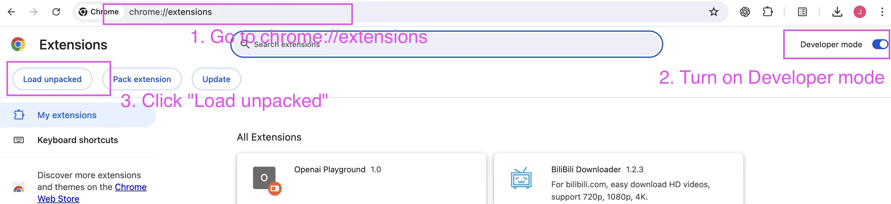
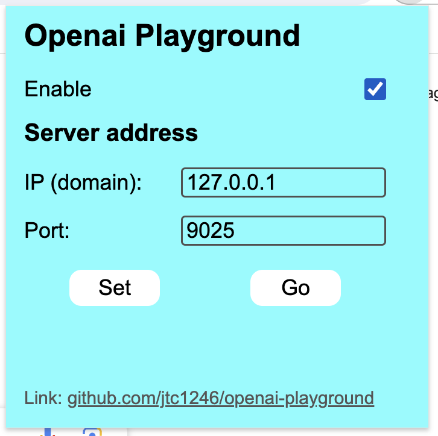

# openai-playground

## Introduction

Use other openai-compatible API services in OpenAI Playground.

It supports:

- Add any openai-compatible API service.
- In stream mode.
- Chatting history storage and export.

This is a useful tool for those AI services that have awful playground experience.

#### Demo:


## Usage

### 1. Requirements

- Has OpenAI API account, and can login (don't need to have money).
- Has Chrome on desktop, and can install extensions.
- python >= 3.9

### 2. Installation (the order of following 2 steps doesn't matter)

#### 2.1 Install python package

```bash
pip install openai-playground
```

#### 2.2 Install Chrome extension

```bash
git clone https://github.com/jtc1246/openai-playground.git
cd openai-playground
```
Or [download the zip](https://github.com/jtc1246/openai-playground/archive/refs/heads/main.zip), and go to openai-playground-main folder.

Then, open Chrome, go to `chrome://extensions/`, turn on `Developer mode`, click `Load unpacked`, and select the `chrome_extension` folder in the `openai-playground` folder.



### 3. Actual Usage

#### 3.1 Run python program

Do basic setups (port, password, storage path, etc.) in python, you can see an example in [example.py](example.py). The python functions usage will be intorduced in the next section.

#### 3.2 Setup Chrome extension

1. Click this extension icon, then it will show the setup page. 
2. Select the "Enable" checkbox, to enable it. 
3. Enter the IP (or domain) and port, then click "Set" to save settings. 
4. Click "Go" to go to OpenAI Playground (playground\.openai.com/playground).

